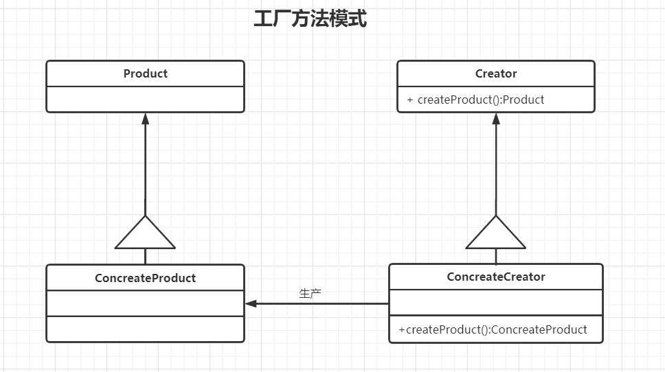

# 工厂方法模式
## 1.意图
&emsp;&emsp;定义一个用于创建对象的接口，让子类决定实例化哪一个类，使一个类的实例化延迟到子类
## 2.别名
&emsp;&emsp;虚构造器
## 3.动机
&emsp;&emsp;考虑这样一个应用框架，它可以向用户展示多个文档。在这个框架中，两个主要的类是类Application和Document，这两个类都是抽象的，客户必须通过它们的子类来做具体应用相关的实现。例如创建一个绘图应用，我们定义DrawingApplication和DrawingDocument。Application负责管理Document并根据需要创建他们。

&emsp;&emsp;因为被实例化的特定的Document子类是与应用相关的，所以Application类不可能预测到哪个Document子类将被实例化，Application类仅仅知道一个新的Document何时应该被创建，而不知道哪种Document将被创建。这就产生了一个尴尬的局面：框架必须实例化，但是它只知道不能被实例化的抽象类

&emsp;&emsp;Factory Method模式提供了一个解决方案。它封装了哪个Document子类将被创建的信息，并将这些信息从框架中分离出来，Application的子类重定义Application的抽象操作CreateDocument以返回适当的Document子类对象，一旦一个Application自立实例化，它就可以实例化与Application相关的Document，而无需知道这些Document的类。我们称CreateDocument是一个<b>工厂方法</b>，因为它负责“生产”一个对象。

## 4.适用性

在以下情况可以使用Factory Method模式：

- 当一个类不知道它所必须创建的对象的类的时候。
- 当一个类希望由它的子类来指定它所创建的对象的时候。
- 当类将创建对象的职责委托给多个帮助子类中的某一个，并且你希望将哪一个帮助子类是代理者这一消息局部化的时候

## 5.结构

## 6.参与者

- Product（Document）
  - 定义工厂方法所创建的接口的对象
- ConcreateProduct（MyDocument）
  - 实现Product接口
- Creator（Application）
  - 声明工厂方法，该方法返回一个Product对象。Creator也可以定义一个工厂方法的缺省实现，它返回一个缺省的ConcreateProduct对象。
  - 可以调用工厂方法以创建一个Product对象。
- ConcreateCreator（MyApplication）
  - 重定义工厂方法以返回一个ConcreteProduct实例
  
## 7.实例代码（见code文件夹）
